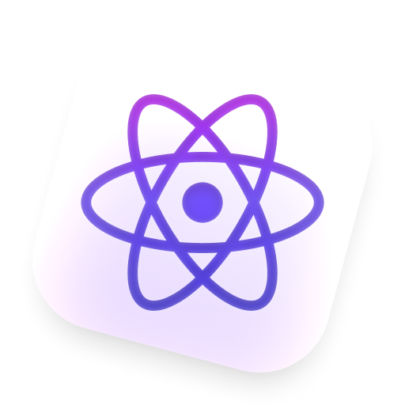

<p align="center">
  <p align="center">
    
  </p>
  <h1 align="center"><b>@rbxts/react</b></h1>
  <p align="center">
    Typescript definitions for React Lua.
    <br />
    <a href="https://npmjs.com/package/@rbxts/react"><strong>npm package →</strong></a>
  </p>
</p>

Roblox-TS type definitions for [React Lua](https://github.com/jsdotlua/react-lua), sourced from the official React types. Currently, only [`@rbxts/react`](https://npmjs.com/package/@rbxts/react) and
[`@rbxts/react-roblox`](https://npmjs.com/package/@rbxts/react-roblox) are available.

If we're missing any deviations from [React Lua](https://jsdotlua.github.io/react-lua/), please [open an issue or pull request](https://github.com/littensy/react-lua/issues/new) to let us know!

> [!IMPORTANT]
> This package requires `roblox-ts@next` to use Generic JSX.

## 📦 Setup

### Installation

Install the `@rbxts/react` and `@rbxts/react-roblox` packages.

```sh
npm install @rbxts/react @rbxts/react-roblox
yarn add @rbxts/react @rbxts/react-roblox
pnpm add @rbxts/react @rbxts/react-roblox # 🔴 See below
```

### Configuration

Set up your `tsconfig.json` to use the React JSX factory.

```json
"compilerOptions": {
  "jsxFactory": "React.createElement",
  "jsxFragmentFactory": "React.Fragment"
}
```

### Usage with PNPM

If you're using PNPM as your package manager, you'll need to create a `.npmrc` file in the root of your project with the following content:

```ini
node-linker=hoisted
```

## 🚀 Examples

### Mounting your app

```tsx
import React, { StrictMode } from "@rbxts/react";
import { createPortal, createRoot } from "@rbxts/react-roblox";

const root = createRoot(new Instance("Folder"));

root.render(<StrictMode>{createPortal(<App />, playerGui)}</StrictMode>);
```

### Counter

```tsx
import React, { useState } from "@rbxts/react";

export function Counter() {
  const [count, setCount] = useState(0);

  return (
    <textbutton
      Text={`Count: ${count}`}
      AnchorPoint={new Vector2(0.5, 0.5)}
      Size={new UDim2(0, 100, 0, 50)}
      Position={new UDim2(0.5, 0, 0.5, 0)}
      Event={{
        Activated: () => setCount(count + 1),
      }}
    >
  );
}
```

## 📚 Resources

- [React Documentation](https://react.dev) - Learn about React's core concepts and API
- [React Lua Documentation](https://jsdotlua.github.io/react-lua/) - A comprehensive guide for the differences between Roact and React
- [JS.Lua Repository](https://github.com/jsdotlua/react-lua) - The source code for React Lua

## 📝 License

This project is licensed under the [MIT license](LICENSE).
